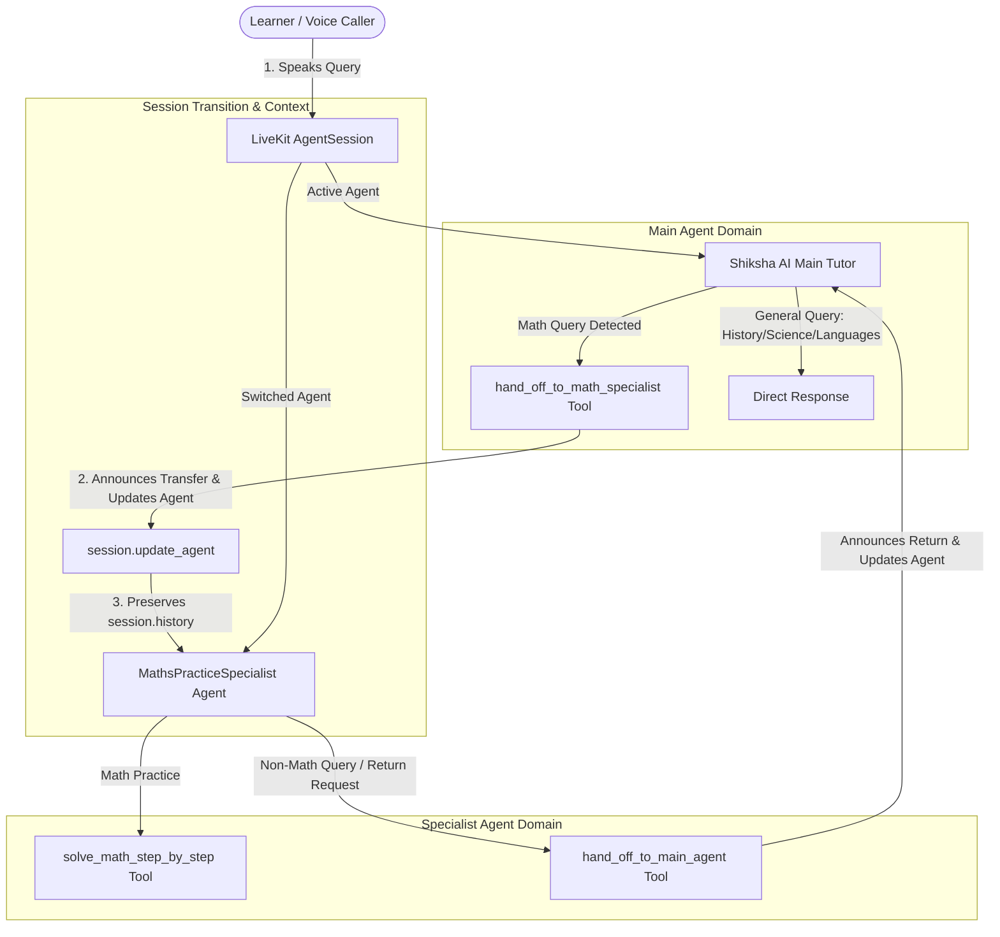

# Day 9 Guide — Hand Off to a Specialist Agent (#VoiceForBharat)

This guide provides complete documentation, architecture specs, testing procedures, video recording steps, and submission instructions for **Day 9: Hand Off to a Specialist Agent** featuring **Shiksha AI (शिक्षा AI)** and the **Maths Practice Specialist (गणित विशेषज्ञ AI)** for the **Learning & Literacy Track**.

---

## 1. Summary of Day 9 Implementation & Enhancements

- **Track**: Learning & Literacy (EdTech - Bharat Edition)
- **Main Agent**: `Shiksha AI (शिक्षा AI)` — AI Learning & Literacy Tutor for Bharat (handles general subjects, language practice, quizzes, caller memory, opt-outs, and human escalation).
- **Specialist Agent**: `MathsPracticeSpecialist (गणित विशेषज्ञ AI)` — Dedicated Maths Practice Specialist.
  - **Single Focused Job**: Provide step-by-step mathematical problem solving, algebra, quadratic equations, fractions, geometry, arithmetic, and NCERT math practice for Indian learners.
  - **Distinct Persona & Limits**: Instructions strictly scoped to math logic. If asked non-math questions (e.g. history, spoken English, science) or requested to return, invokes `hand_off_to_main_agent`.
- **Step 3: Main Agent Handoff Tool (`hand_off_to_math_specialist`)**:
  - Main agent detects math practice requests, announces the transfer to the user, and calls `session.update_agent(math_specialist)`.
- **Step 4: Shared Session History & Context Retention**:
  - LiveKit `AgentSession` context (`session.history`) is retained automatically across agent updates. The specialist receives full conversation history without requiring the user to re-explain their question!
- **Step 5: User Announcement & Agent Introduction**:
  - Main Agent announces: *"I will connect you to our Maths practice specialist, who will work through this problem with you step by step."* (Devanagari: *"मैं आपको हमारे गणित विशेषज्ञ AI से कनेक्ट कर रहा हूँ।"*)
  - Specialist Agent introduces itself: *"Namaste! I am the Maths Practice Specialist for Shiksha AI. Let's solve your math problem step by step!"*
- **Step 6 & Advanced: Bi-Directional Handback Tool (`hand_off_to_main_agent`)**:
  - Specialist Agent can hand back control to the main tutor when non-math topics are requested.
- **Automated Pytest Suite (`backend/tests/test_day9_handoff.py`)**:
  - 4/4 passing tests verifying tool definitions, prompt differentiation, math solver, agent transitions, and session context retention.

---

## 2. Multi-Agent Handoff Architecture Diagram



---

## 3. Day 9 Verification Matrix

| Step / Requirement | Implementation Detail | Status |
| :--- | :--- | :---: |
| **Step 1: Choose Specialist** | Maths Practice Specialist (`MathsPracticeSpecialist`) for Learning & Literacy track | ✅ Complete |
| **Step 2: Create Separate Agent** | Created `MathsPracticeSpecialist(Agent)` with distinct `MATH_SPECIALIST_PROMPT` & limits | ✅ Complete |
| **Step 3: Add Handoff Tool** | `hand_off_to_math_specialist` added to Main Agent with clear docstrings & triggers | ✅ Complete |
| **Step 4: Context Retention** | Shared `session.history` preserved automatically on `session.update_agent` | ✅ Complete |
| **Step 5: User Announcements** | Main agent announces transfer; Specialist introduces itself upon taking over | ✅ Complete |
| **Step 6: Test Both Paths** | General query stays with Main Agent; Math query hands off to Specialist | ✅ Complete |
| **Advanced: Bi-Directional Handback** | `hand_off_to_main_agent` enables Specialist to return conversation to Main Agent | ✅ Complete |
| **Advanced: Math Solver Tool** | `solve_math_step_by_step` generates structured NCERT solution breakdowns | ✅ Complete |
| **Automated Pytest Suite** | `backend/tests/test_day9_handoff.py` (4/4 passing) | ✅ Complete |
| **UI & Header Badges** | Header badge updated to `DAY 9 • SPECIALIST AGENT HANDOFF (MATHS SPECIALIST)` | ✅ Complete |

---

## 4. How to Run & Verify Day 9

### Step 1: Run Pytest Test Suite
Execute the pytest suite covering tool registration, system prompt differentiation, math solver, and bi-directional handoff transitions:
```powershell
cd backend
& "d:\ten day voice agent bharat edition\backend\.venv\Scripts\python.exe" -m pytest tests/test_day9_handoff.py
```

### Step 2: Start the Web Application
```powershell
.\start_app.ps1
```
Open browser at `http://localhost:3000`.

### Step 3: Test Both Voice Paths in Browser
1. **Path 1 (Normal Question — Stays with Main Agent)**:
   - Ask: *"What was the Dandi Salt March in Indian history?"*
   - **Result**: Main Agent (`Shiksha AI`) answers directly. Handoff is NOT triggered.
2. **Path 2 (Specialist Question — Main Agent Hands Off)**:
   - Ask: *"Can you help me solve 2x^2 + 5x + 3 = 0?"* or *"मेरा math का homework करवाओ"*
   - **Result**: Main Agent announces: *"I will connect you to our Maths practice specialist..."*, then invokes `hand_off_to_math_specialist`.
   - **Specialist Takeover**: Specialist Agent introduces itself: *"Namaste! I am the Maths Practice Specialist for Shiksha AI..."* and walks through the steps using `solve_math_step_by_step`.
3. **Path 3 (Handback — Specialist Returns to Main Agent)**:
   - Ask: *"Thanks! Now explain Python loops."*
   - **Result**: Specialist announces return to main agent and invokes `hand_off_to_main_agent`.

---

## 5. Video Recording Instructions (Step 7)

Record a 45-60 second screen recording demonstrating:
1. **Normal Question**: User asking a history query, Main Agent answering.
2. **Handoff Request**: User asking for math quadratic equation practice (`2x^2 + 5x + 3 = 0`).
3. **Handoff Announcement**: Main Agent announcing transfer to Maths Specialist aloud.
4. **Specialist Continuation**: Specialist Agent introducing itself, invoking `solve_math_step_by_step`, and breaking down the math equation step by step.

---

## 6. LinkedIn Post Template (#VoiceForBharat)

**Title**: Day 9 of 10 Days of Voice Agents — Specialist Agent Handoff 🧮🎙️

**Post Body**:
```text
Day 9 of 10 Days of Voice Agents: Hand Off to a Specialist Agent! 🚀 #VoiceForBharat

One agent shouldn't try to be an expert at everything! For Day 9 of #VoiceForBharat, I added a Multi-Agent Handoff Architecture to Shiksha AI (शिक्षा AI) — our EdTech Voice Agent for Bharat built with Murf Falcon TTS!

Key capabilities built today:
1. 🧮 Dedicated Specialist Agent: Created `MathsPracticeSpecialist (गणित विशेषज्ञ AI)` focused strictly on step-by-step math problem solving, quadratic equations, algebra, and NCERT practice.
2. 🔄 Handoff Tool (`hand_off_to_math_specialist`): Main agent detects math practice requests, announces the transfer aloud, and dynamically updates the LiveKit session agent (`session.update_agent`).
3. 🧠 Shared Conversation Context: Session history (`session.history`) is preserved across agent handoffs so the learner never has to re-explain their question!
4. ↩️ Bi-Directional Handback (`hand_off_to_main_agent`): If the student switches back to non-math subjects (like history or coding), the specialist transfers control back to the main tutor.
5. 🧪 Automated Test Suite: Verified via Pytest suite covering tool registration, system prompts, math solver, and bi-directional transitions.

Powered by Murf Falcon TTS (55ms latency) for ultra-fast, human-like voice responses!

Tagging @Murf AI | #VoiceForBharat #EdTech #AI #VoiceAgents #Bharat #MurfAI #LiveKit #MultiAgent #Python #NextJS
```
