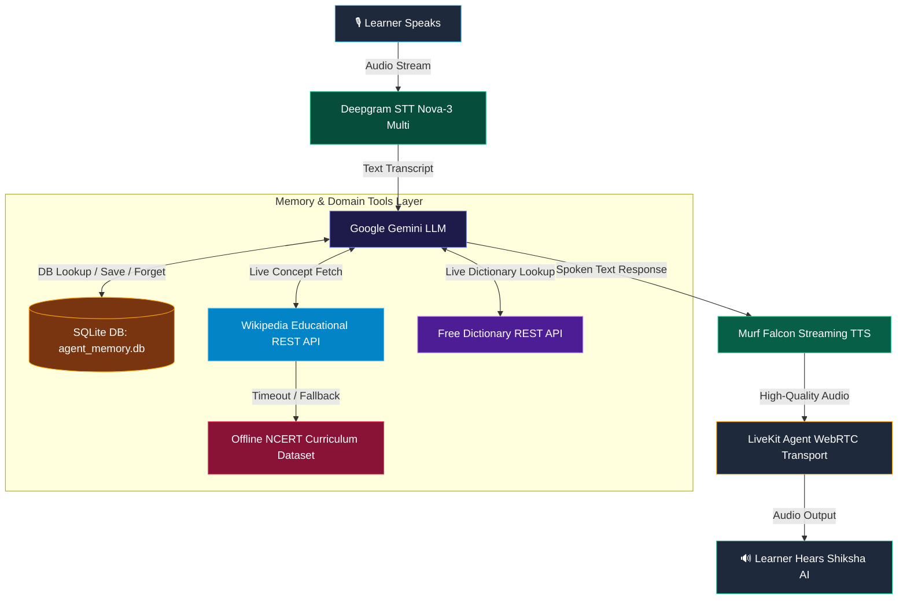

# 🎙️ #VoiceForBharat — 10 Days of Voice AI Challenge (Bharat Edition)

[](https://opensource.org/licenses/MIT) 
[-6366F1)](https://murf.ai/api/docs/text-to-speech/streaming) 
[](https://docs.livekit.io) 
[](https://deepgram.com) 
[](https://aistudio.google.com/) 
[-003B57)](https://www.sqlite.org/)

Welcome to the **10 Days of Voice AI Challenge (#VoiceForBharat)** repository featuring **Shiksha AI (शिक्षा AI)** — a Human-Type AI Voice Tutor built for Bharat (EdTech Track).

**Shiksha AI** is an empathetic, patient, and multi-subject AI voice tutor that speaks fluent English, Hindi (native Devanagari script), and Hinglish. It features persistent SQLite learner memory, explicit caller consent rules, live REST API domain tools for multi-subject and language learning, memory tool chaining, and graceful out-loud failure fallbacks.

---

## 📂 10 Days Challenge Progress Tracker

| Day | Focus / Theme | Agent Name | Guide & Highlights | Status |
|---|---|---|---|:---:|
| **Day 1** | Voice Setup & LiveKit Engine | **IndicVox AI** | Real-time audio pipeline with Murf Falcon TTS & LiveKit | ✅ Completed |
| **Day 2** | Persona, Objectives & Guardrails | **Shiksha AI** | Hard refusals on ADHD/medical diagnosis, zero shaming, Hinglish support | ✅ Completed |
| **Day 3** | Smart Classroom UI & 5 States | **Shiksha AI** | Human character avatar, 5 Agent States, Mic unblock modal, EN/Hindi toggle | ✅ Completed |
| **Day 4** | Persistent Memory & Consent | **Shiksha AI** | SQLite database (`agent_memory.db`), learner facts, returning caller recognition, explicit consent rule | ✅ Completed |
| **Day 5** | Domain Tools & Multi-Subject Engine | **Shiksha AI** | [DAY5_GUIDE.md](./DAY5_GUIDE.md): Live Educational API, multi-subject & language learning, Day 4 tool chaining, graceful out-loud fallbacks | ✅ Completed |
| **Day 6** | Outbound Calls & Telephony | **Shiksha AI** | [DAY6_GUIDE.md](./DAY6_GUIDE.md): LiveKit SIP/Twilio outbound dispatch, 2-sentence opening script (Who, Why, Opt-Out), SQLite call log, outcome & retry rules | ✅ Completed |
| **Day 7** | Know When to Ask for Human Help | **Shiksha AI** | [DAY7_GUIDE.md](./DAY7_GUIDE.md): Human escalation tool (`create_escalation`), hard consent rule, PII scrubbing, SQLite & Discord Webhook tickets, live admin dashboard | ✅ Completed |
| **Day 8** | Track Performance & Call Analytics | **Shiksha AI** | [DAY8_GUIDE.md](./DAY8_GUIDE.md): Call metrics, SQLite `call_analytics` schema, real-time `/analytics` dashboard, failure category breakdown & automated tests | ✅ Completed |

---

## 🏗️ Architecture & Data Pipeline



---

## ⚡ Quick Start Guide (Run Locally in 2 Minutes)

### Step 1: Environment Setup
1. Copy `murf-livekit-starter/backend/.env.example` to `murf-livekit-starter/backend/.env.local`
2. Copy `murf-livekit-starter/frontend/.env.example` to `murf-livekit-starter/frontend/.env.local`
3. Add your API keys in `backend/.env.local`:
   - `LIVEKIT_URL`, `LIVEKIT_API_KEY`, `LIVEKIT_API_SECRET` ([LiveKit Cloud](https://cloud.livekit.io/))
   - `MURF_API_KEY` ([Murf AI](https://murf.ai/))
   - `DEEPGRAM_API_KEY` ([Deepgram](https://deepgram.com/))
   - `GOOGLE_API_KEY` ([Google AI Studio](https://aistudio.google.com/))

### Step 2: Run Application
- **Windows (PowerShell)**:
  ```powershell
  .\start_app.ps1
  ```
- **macOS / Linux (Bash)**:
  ```bash
  chmod +x start_app.sh
  ./start_app.sh
  ```
Open **`http://localhost:3000`** in your browser!

---

## 🌟 Key Features Highlighted by Day

### 🌟 Day 3 Highlight: Smart Classroom UI & 5 Agent States
- **Human-Type AI Tutor Avatar**: Interactive avatar with smooth skin tones, blinking pupils, animated voice mouth equalizer, and ambient aura lighting.
- **5 Explicit Agent States**:
  1. 🟢 **Ready**: Single clear start button on Welcome Screen
  2. 🟡 **Connecting**: Live connection wait status
  3. 🟢 **Listening**: *"Listening to you... (आपकी बात सुन रहे हैं)"* badge
  4. 🟠 **Speaking**: *"Shiksha AI is speaking..."* saffron aura
  5. 🔴 **Call Ended**: Session summary with 1-click restart option
- **Microphone Error Handling**: Step-by-step browser unblock modal in English & Hindi.
- **Dual-Language UI**: Toggle `[ 🌐 EN ∣ 🇮🇳 हिन्दी ]` for all UI text.

### 🧠 Day 4 Highlight: Persistent Memory, Tools & User Consent
- **SQLite Database Memory (`agent_memory.db`)**: Stores learner identity, preferred language register, current grade level, topics covered, repeated struggles, and target study goals.
- **LLM Function Tools**:
  - `lookup_caller(user_id_or_name)`: Reads caller history from SQLite.
  - `save_caller_facts(...)`: Saves learner profile into SQLite.
  - `forget_caller(user_id_or_name)`: Permanently erases caller records upon request.
- **Hard Consent Rule**: The agent ALWAYS asks explicit permission (*"क्या मैं आपका लर्निंग डेटा और टॉपिक्स सेव कर लूँ?"*) BEFORE invoking `save_caller_facts`. If the caller says "No", no data is stored.
- **Returning Learner Greeting**: Automatically recognizes returning callers on call start and welcomes them back by name (*"नमस्ते रमेश जी! पिछली बार हमने Class 8 Math fractions पढ़ा था..."*).

### 🛠️ Day 5 Highlight: Real Domain Tools, Multi-Subject & Language Learning
- **Real Domain Tools (`src/tools.py`)**:
  - `fetch_ncert_exercise_and_syllabus`: Connects to live Wikipedia REST API to fetch concept summaries and practice questions for any subject.
  - `fetch_language_lesson_and_vocabulary`: Teaches lessons, script guides, greetings, and spoken practice exercises for ANY language.
  - `fetch_subject_quiz_and_solution`: Generates educational practice quizzes with step-by-step solutions.
  - `lookup_word_meaning_and_origin`: Queries live dictionary API for definitions, phonetics, and origins.
- **Multi-Subject & Multi-Language Support**:
  - **Subjects**: Mathematics, Physics, Chemistry, Biology, History, Geography, Civics, Economics, Computer Science / Coding, General Knowledge, Literature.
  - **Languages**: Hindi, Sanskrit, Tamil, Telugu, Marathi, Gujarati, Bengali, Punjabi, Kannada, Malayalam, Spoken English, French, Spanish, German, Japanese.
- **Day 4 + Day 5 Memory Tool Chaining**: Automatically inspects saved grade/language level from Day 4 SQLite memory if omitted by the user (e.g. asking for *"exercise on Light"* auto-retrieves *"Class 10 Science"*).
- **Graceful Out-Loud Failure Path**: Catches HTTP timeouts/network errors and explicitly speaks the failure state aloud (*"The live network connection timed out, but here is the official NCERT offline curriculum..."*) with zero silence or hallucinations.
- **Timestamped Attribution**: All returned data is timestamped (*"Sourced live as of today (2026-08-10)"*).
- **Smoother Character Skin & UI HUD**: Redesigned tutor avatar with silky warm skin gradients, cheek blush, eye highlights, and a live Multi-Subject HUD status header in the script layout.

---

## 📁 Repository Directory Structure

```text
ten-day-voice-agent-bharat-edition/
├── DAY1_GUIDE.md            # Day 1 Setup Guide
├── DAY2_GUIDE.md            # Day 2 Persona & Guardrails Guide
├── DAY3_GUIDE.md            # Day 3 Frontend & 5 Agent States Guide
├── DAY4_GUIDE.md            # Day 4 SQLite Memory & Consent Guide
├── DAY5_GUIDE.md            # Day 5 Real Domain Tools & Multi-Subject Guide
├── README.md                # Main Repository Readme
├── start_app.ps1            # Windows Application Starter Script
├── start_app.sh             # Linux/macOS Application Starter Script
├── backend -> murf-livekit-starter/backend (Symlink)
├── frontend -> murf-livekit-starter/frontend (Symlink)
└── murf-livekit-starter/
    ├── backend/             # LiveKit Python Agent Backend
    │   ├── src/
    │   │   ├── agent.py     # Main Shiksha AI Agent Logic & Pipeline
    │   │   ├── tools.py     # Day 5 Real Domain Tools & Language Engine
    │   │   └── db.py        # Day 4 SQLite Memory Database Handler
    │   └── tests/
    │       └── test_day5_tools.py # Pytest Unit Suite for Day 5 Tools
    └── frontend/            # Next.js 15 Smart Classroom Web App
        ├── app/             # App Router Pages & Token Endpoints
        └── components/
            ├── app/
            │   ├── human-ai-tutor.tsx  # Interactive Character Avatar
            │   └── welcome-view.tsx    # Day 5 Welcome Screen & Scenarios
            └── agents-ui/
                └── agent-chat-transcript.tsx # Smart Classroom HUD Layout
```

---

## 🧪 Running Automated Unit Tests

To run the Day 5 automated unit test suite:
```powershell
cd murf-livekit-starter/backend
uv run pytest tests/test_day5_tools.py
```

---

## 📄 License & Credits

Built with ❤️ for **#VoiceForBharat** — 10 Days of Voice Challenge by [Murf AI](https://murf.ai/).  
Licensed under the [MIT License](LICENSE).
